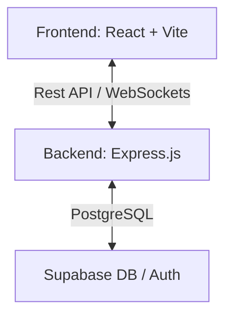

# <div align="center"><br>Bhojanālaya</div>

<div align="center">
  <h3>✨ Skip the Queue, Book Food Instantly ✨</h3>
  <p>A premium, full-stack restaurant ordering and table booking platform built for modern dining experiences.</p>
</div>

---

<p align="center">
  <a href="#🚀-getting-started">Getting Started</a> •
  <a href="#✨-features">Features</a> •
  <a href="#🛠️-tech-stack">Tech Stack</a> •
  <a href="#🎨-design-highlights">Design</a> •
  <a href="https://github.com/VARA4u-tech/bitebook-direct">Repository</a>
</p>

---

## 🏗️ Project Architecture

Bhojanālaya follows a clean, decoupled architecture with a focus on performance and real-time updates.



### 📂 Directory Structure

```bash
bitebook-direct/
├── frontend/          # 🎨 React + Vite + Tailwind CSS
│   ├── src/           # Components, Pages, State Hooks
│   ├── public/        # Icons, Branding, Static Assets
├── backend/           # ⚙️ Express.js + TypeScript
│   ├── src/           # API Routes, Controllers, Middleware
│   └── schema.sql     # Database Architecture
└── README.md          # 📍 Project Documentation
```

## 🚀 Getting Started

### 🖥️ Frontend Setup

```bash
cd frontend
npm install
npm run dev
```

👉 _Live at: `http://localhost:8080`_

### 🛠️ Backend Setup

```bash
cd backend
npm install
# Configure .env with Supabase keys
npm run dev
```

👉 _API at: `http://localhost:3000`_

---

## ✨ Premium Features

- 🏥 **Multi-Restaurant Ecosystem**: Centralized hub for diverse dining options.
- ⚡ **Real-Time Tracking**: Instant status updates via Socket.io.
- 📅 **Smart Reservations**: Seamless table booking with capacity management.
- 🔍 **Advanced Filtering**: Precision search by cuisine, price, and dietary needs.
- 📱 **Mobile-First UX**: Tactile, responsive design for on-the-go booking.
- 🎭 **Glassmorphism UI**: High-end aesthetic with buttery-smooth Framer Motion animations.

## 🛠️ Tech Stack & Skills

| Category       | Technology                               |
| :------------- | :--------------------------------------- |
| **Frontend**   | React 18, TypeScript, Vite, Tailwind CSS |
| **Animations** | Framer Motion, GSAP                      |
| **State**      | Zustand, React Query                     |
| **Backend**    | Node.js, Express.js, TypeScript          |
| **Database**   | Supabase (PostgreSQL), Auth, Storage     |
| **Validation** | Zod, JWT                                 |
| **Real-time**  | Socket.io                                |

## 🎨 Design Excellence

- **Iconic Branding**: Elegant lotus-inspired visual identity.
- **Micro-interactions**: Subtle hover effects and feedback loops.
- **SEO Optimized**: Semantic HTML and performance-tuned for search engines.
- **Accessibility**: Built with Radix UI primitives for WCAG compliance.

---

<div align="center">
  <p><b>Developed with ❤️ by <a href="https://github.com/VARA4u-tech">VARA4u-tech</a></b></p>
  <p><i>Empowering the next generation of dining technology.</i></p>
</div>
